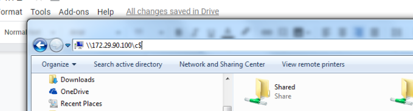
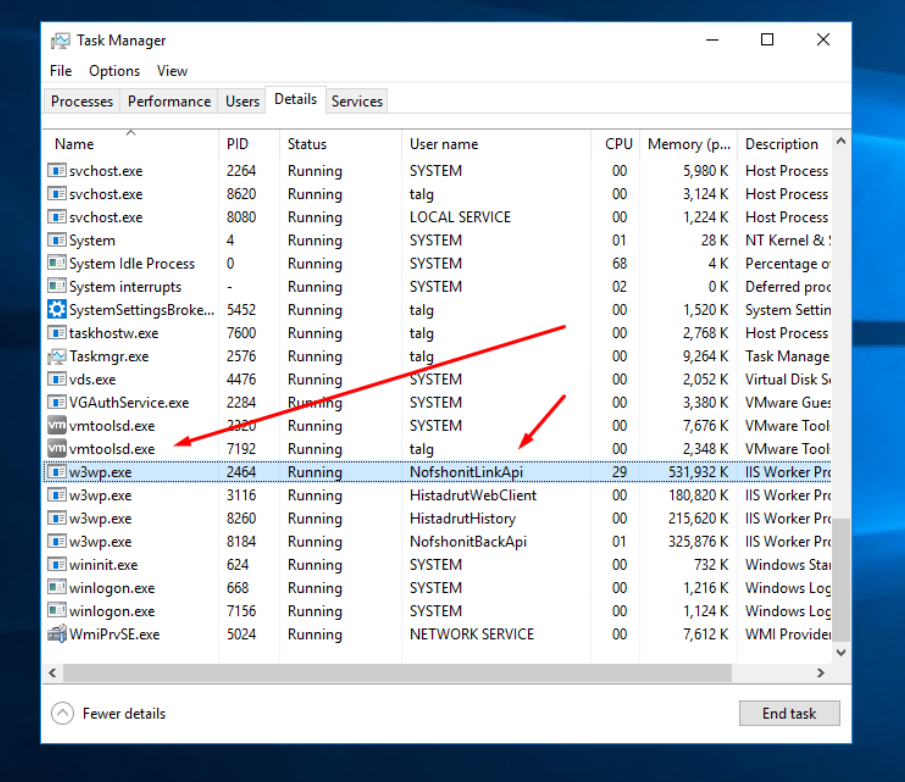
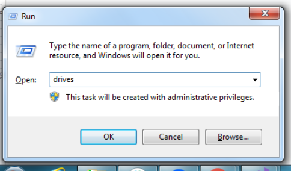
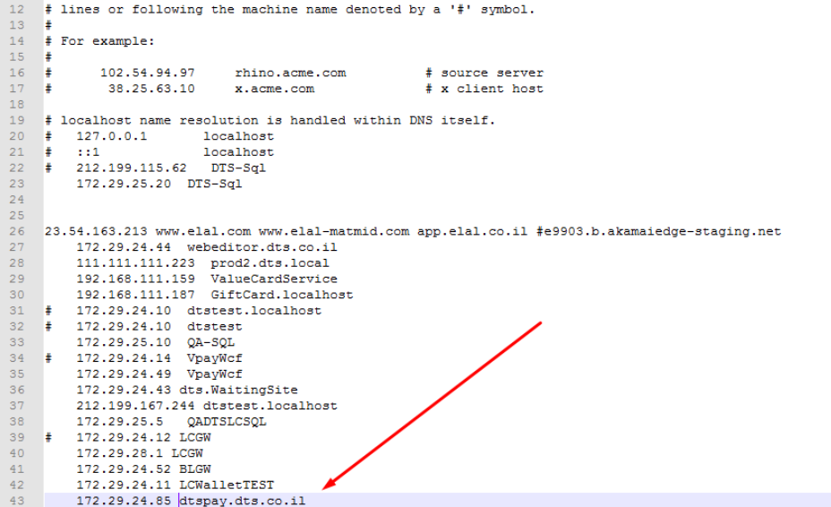

# Servers

Test: 172.29.92.20

Pre-Prod: 172.29.92.20

Production: 172.29.25.20

# IIS Servers

Test: 172.29.90.100

Pre-Prod: 172.29.46.10

Production: 172.29.24.197-199

# Upload Backend Version

- Publish your project.
- Enter the desired IIS Server.
- Go to \Documents\Backups and create a new folder with the current date.
- Create a backup of the Site your uploading a version to and put it in the backups folder.
- Possible site names:
  - Test: NofshnoitBackApi.com
  - Pre-Prod: NofshnoitBackApi
  - Production: NofshonitBackApi
- Inside the folder you created in backups, create another folder that will hold the new published version.

- When Publishing choose project NofshonitApi & LinkAPI.
- Copy all the files in the published project folder and take every file except appsettings.json, appsetting.dev.json, web.config.
- We only upload the appsettings and web.config if one of our team members made changes to these files.

- To upload the version go to the IIS manager (Search: inetmgr) and find the Application Pool.
  Make sure you have all 3 servers open on the NofshonitBackApi Process at the Application pool. Stop all NofshonitBackApi processes in those servers and copy the published files to NofshonitBackApi at server 172.29.24.197 and quickly start those procceses again.

- Go to Hist website / Test / Pre-Prod and check if there are any CORS Errors at the console.

- You can check if the api is running well by going to: 172.29.X.X/api/values

# Common Problems

You cant copy files from your computer to the remote server.

open a folder and write: \\172.29.X.X\c\$

This will ask for your login credentionals and then it will open the C drive at that server.

#

You cant move the files into the Site folder, make sure you've stopped the relevant Site's process and then try to move the files.

If this did not work open the Task Manager and close the relevant process:

#

## If you run a script in Pre-Prod / Test you must run the same script in production even when changing the values of a select procedure / view.

#

Make sure the Cors Origin inside the appsettings.json file is correct:

(Production)

"CorsOrigins": {
"Origins": "https://www.hist.org.il;https://hist.org.il;"
},

#

Some of the services we work with require us to use its DNS address that we need to set inside the hosts file.

Inorder to get there use the Run window and run: drives

Enter etc folder and open the hosts file with a text editor.

Add the relevant IP and DNS address like so:

# Working with MINT

## General knowledege:

Mint shows the user our website through a webview in their app.
with the get request to our site they add the AccessToken which holds the
values of MemberId and creation time of access token.

The token is valid for 24.

Ususally Mint will show the user our product pages, when they want to purchase if
their logged in they will be routed accordingly to the shopping cart and payment page.

If the user is not registered with Beyahad website he will be routed to the login
process and after he finishes the process of Join -> UpdatePassword -> Registration
he will be redirected to the product he wanted to purchase.

## Work Process:

Inorder to enter the website using the MINT version
you need to create an Access Token.
To create the Access token you need access to NofshonitBackApi project locally.

Send a postman request to /api/users/getSilentLoginMember?accessToken=MemberID
Make sure to send MemberID as the value of the accessToken parameter.

Put a breakpoint at UserBL_Histadrut -> GetUserTokenByAccessToken.
there is an identical function which is not involved in the MINT process.

Take the value of mintAccessToken variable, this will be our generated AccessToken
which is valid for 24 hours and hold data about our users MemberID.

Now you can access MINT website version using the available MINT Urls at RoutesPath file.

Usage:

http://localhost:4001/mint/category/productPage/1646?accessToken=PutTokenHere
